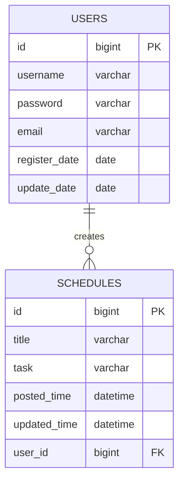

# 일정 관리 애플리케이션 (Schedule Management Application)

## 개요
사용자가 일정을 생성, 조회, 수정, 삭제할 수 있는 RESTful API 기반 일정 관리 시스템입니다.

## 기술 스택
- Java 17
- Spring Boot
- MySQL
- JdbcTemplate

## ERD 



## API 명세

## 기본 정보
- 기본 URL: `/api/schedules`
- 응답 형식: JSON
- 문자 인코딩: UTF-8

## API 목록

| Method | URI | 설명 | 요청 파라미터 | 응답 코드 |
|--------|-----|------|--------------|-----------|
| POST | `/api/schedules` | 일정 생성 | title, task, userName, password | 201 |
| GET | `/api/schedules` | 전체 일정 조회 | page, size | 200 |
| GET | `/api/schedules/{id}` | 특정 일정 조회 | id | 200 |
| GET | `/api/schedules/search` | 일정 검색 | userId, date | 200 |
| PATCH | `/api/schedules/{id}` | 일정 수정 | id, title, task, password | 204 |
| DELETE | `/api/schedules/{id}` | 일정 삭제 | id, password | 204 |

## 요청 본문 상세

### 1. 일정 생성 (POST)
```json
{
    "title": "일정 제목",
    "task": "할 일 내용",
    "userName": "사용자명",
    "password": "비밀번호"
}
```

### 2. 일정 수정 (PATCH)
```json
{
    "title": "수정된 제목",
    "task": "수정된 내용",
    "password": "비밀번호"
}
```

### 3. 일정 삭제 (DELETE)
```json
{
    "password": "비밀번호"
}
```

## 응답 본문 상세

### 1. 단일 일정 조회 응답
```json
{
    "id": 1,
    "title": "일정 제목",
    "task": "할 일 내용",
    "userName": "사용자명",
    "createdAt": "2024-03-21 14:30",
    "updatedAt": "2024-03-21 14:30"
}
```

### 2. 페이징 처리된 목록 조회 응답
```json
{
    "content": [
        {
            "id": 1,
            "title": "일정 제목",
            "task": "할 일 내용",
            "userName": "사용자명",
            "createdAt": "2024-03-21 14:30",
            "updatedAt": "2024-03-21 14:30"
        }
    ],
    "page": 0,
    "totalPages": 1,
    "totalElements": 1,
    "size": 10
}
```

## 오류 응답 코드

| 상태 코드 | 설명 | 응답 메시지 예시 |
|-----------|------|-----------------|
| 400 | 잘못된 요청 | "유효성 검사 실패 메시지" |
| 404 | 리소스 없음 | "요청한 리소스를 찾을 수 없습니다" |
| 500 | 서버 오류 | "내부 서버 오류가 발생했습니다" |

## 요청 필드 설명

| 필드명 | 타입 | 필수여부 | 설명 |
|--------|------|----------|------|
| title | String | 필수 | 일정 제목 (1-100자) |
| task | String | 필수 | 할 일 내용 (1-200자) |
| userName | String | 필수 | 사용자 이름 |
| password | String | 필수 | 비밀번호 (3자 이상) |
| page | Integer | 선택 | 페이지 번호 (기본값: 0) |
| size | Integer | 선택 | 페이지 크기 (기본값: 10) |


## 데이터베이스 스키마

>```sql
>CREATE SCHEMA IF NOT EXISTS ScheduleManagementApplicationSchema;
>CREATE TABLE users (
>id BIGINT AUTO_INCREMENT PRIMARY KEY,
>username VARCHAR(100) NOT NULL,
>password VARCHAR(100) NOT NULL,
>email VARCHAR(100),
>register_date DATE NOT NULL,
>update_date DATE NOT NULL
>);
>
>CREATE TABLE schedules (
>id BIGINT AUTO_INCREMENT PRIMARY KEY,
>title VARCHAR(100) NOT NULL,
>task VARCHAR(200) NOT NULL,
>posted_time DATETIME NOT NULL,
>updated_time DATETIME NOT NULL,
>user_id BIGINT NOT NULL,
>FOREIGN KEY (user_id) REFERENCES users(id)
>);

## 주요 기능
- 일정 CRUD 작업
- 페이지네이션을 통한 일정 목록 조회
- 사용자 기반 일정 관리
- 날짜별 일정 검색
- 비밀번호 기반 일정 수정/삭제 인증

## 오류 처리
- 400 Bad Request: 잘못된 요청 (유효성 검사 실패)
- 404 Not Found: 리소스를 찾을 수 없음
- 500 Internal Server Error: 서버 내부 오류
 
